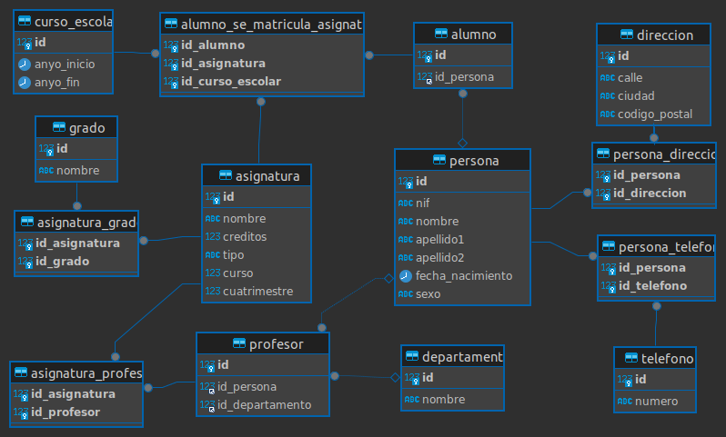

# Universidad



###     Consultas sobre una tabla

1. Devuelve un listado con el primer apellido, segundo apellido y el nombre de
  todos los alumnos. El listado deberá estar ordenado alfabéticamente de
  menor a mayor por el primer apellido, segundo apellido y nombre.

  ```SQL
  SELECT p.apellido1, p.apellido2, p.nombre
  FROM persona p 
  JOIN alumno a ON p.id = a.id_persona
  ORDER BY p.apellido1, p.apellido2, p.nombre ASC;
  
  +------------+-----------+----------+
  | apellido1  | apellido2 | nombre   |
  +------------+-----------+----------+
  | Domínguez  | Guerrero  | Antonio  |
  | Gea        | Ruiz      | Sonia    |
  | Gutiérrez  | López     | Juan     |
  | Heller     | Pagac     | Pedro    |
  | Herman     | Pacocha   | Daniel   |
  | Hernández  | Martínez  | Irene    |
  | Herzog     | Tremblay  | Ramón    |
  | Koss       | Bayer     | José     |
  | Lakin      | Yundt     | Inma     |
  | Saez       | Vega      | Juan     |
  | Sánchez    | Pérez     | Salvador |
  | Strosin    | Turcotte  | Ismael   |
  +------------+-----------+----------+
  12 rows in set (0,00 sec)
  ```

  

2. Averigua el nombre y los dos apellidos de los alumnos que no han dado de
  alta su número de teléfono en la base de datos.

  ```SQL
  SELECT p.nombre, p.apellido1, p.apellido2
  FROM persona p
  JOIN alumno a ON p.id = a.id_persona
  WHERE p.id NOT IN (
      SELECT id_persona
      FROM persona_telefono
  );
  
  +--------+-----------+-----------+
  | nombre | apellido1 | apellido2 |
  +--------+-----------+-----------+
  | Luis   | Gamboa    | Hernandez |
  +--------+-----------+-----------+
  1 row in set (0,00 sec)
  ```

  

3. Devuelve el listado de los alumnos que nacieron en 1999.

   ```sql
   SELECT p.nombre
   FROM persona p
   JOIN alumno a ON p.id = a.id_persona
   WHERE YEAR(p.fecha_nacimiento) = 1999;
   +---------+
   | nombre  |
   +---------+
   | Ismael  |
   | Antonio |
   +---------+
   2 rows in set (0,00 sec)
   ```

4. Devuelve el listado de profesores que no han dado de alta su número de
  teléfono en la base de datos y además su nif termina en K.

  ```SQL
  SELECT p.nombre, p.apellido1, p.apellido2
  FROM persona p
  JOIN profesor pr ON p.id = pr.id_persona
  WHERE p.id NOT IN (
      SELECT id_persona
      FROM persona_telefono
  );
  
  Empty set (0,01 sec)
  
  ```

  

5. Devuelve el listado de las asignaturas que se imparten en el primer
  cuatrimestre, en el tercer curso del grado que tiene el identificador 7.

  ```sql
  SELECT a.nombre 
  FROM asignatura a
  JOIN asignatura_grado ag ON a.id = ag.id_asignatura
  WHERE ag.id_grado = 7
      AND a.curso = 3 
      AND a.cuatrimestre = 1;
  
  Empty set (0,00 sec)
  ```

  

  ### Consultas multi-tabla (Composición interna)

6. Devuelve un listado con los datos de todas las alumnas que se han
  matriculado alguna vez en el Grado en Ingeniería Informática (Plan 2015).

  ```sql
  select p.nombre, p.apellido1, p.apellido2
  from persona p
  inner join alumno a on p.id = a.id_persona
  inner join alumno_se_matricula_asignatura asma on a.id = asma.id_alumno
  inner join asignatura_grado ag on asma.id_asignatura = ag.id_asignatura
  inner join grado g on g.id = ag.id_grado
  where g.nombre = 'Grado en Ingeniería Informática (Plan 2015)' AND p.sexo = 'M';
  
  
  Empty set (0,00 sec)
  ```

  

7. Devuelve un listado con todas las asignaturas ofertadas en el Grado en
  Ingeniería Informática (Plan 2015).

  ```sql
  select a.nombre
  from asignatura a
  inner join asignatura_grado ag on a.id = ag.id_asignatura
  inner join grado g on ag.id_grado = g.id
  where g.nombre = 'Grado en Ingeniería Informática (Plan 2015)'
  
  +------------------------------+
  | nombre                       |
  +------------------------------+
  | Arquitectura de Computadores |
  | Sistemas Operativos          |
  | Bases de Datos               |
  | Seguridad Informática        |
  +------------------------------+
  4 rows in set (0,00 sec)
  ```

  

8. Devuelve un listado de los profesores junto con el nombre del
  departamento al que están vinculados. El listado debe devolver cuatro
  columnas, primer apellido, segundo apellido, nombre y nombre del
  departamento. El resultado estará ordenado alfabéticamente de menor a
  mayor por los apellidos y el nombre.

  ```sql
  select p.apellido1, p.apellido2, p.nombre, dp.nombre as departamento
  from persona p
  inner join profesor pf on p.id = pf.id_persona
  inner join departamento dp on pf.id_departamento = dp.id
  order by p.apellido1, p.apellido2, p.nombre;
  
  +------------+------------+-----------+---------------------+
  | apellido1  | apellido2  | nombre    | departamento        |
  +------------+------------+-----------+---------------------+
  | Domínguez  | Hernández  | María     | Matemáticas         |
  | Fahey      | Considine  | Antonio   | Economía y Empresa  |
  | Guerrero   | Martínez   | Juan      | Informática         |
  | Hamill     | Kozey      | Manolo    | Informática         |
  | Kohler     | Schoen     | Alejandro | Matemáticas         |
  | Lemke      | Rutherford | Cristina  | Economía y Empresa  |
  | Monahan    | Murray     | Micaela   | Agronomía           |
  | Ramirez    | Gea        | Zoe       | Informática         |
  | Ruecker    | Upton      | Guillermo | Educación           |
  | Sánchez    | Ruiz       | Pepe      | Informática         |
  | Schmidt    | Fisher     | David     | Matemáticas         |
  | Schowalter | Muller     | Francesca | Filología           |
  | Spencer    | Lakin      | Esther    | Educación           |
  | Stiedemann | Morissette | Alfredo   | Química y Física    |
  | Streich    | Hirthe     | Carmen    | Educación           |
  +------------+------------+-----------+---------------------+
  15 rows in set (0,00 sec)
  ```

  

9. Devuelve un listado con el nombre de las asignaturas, año de inicio y año de
  fin del curso escolar del alumno con nif 26902806M.

  ```sql
  SELECT a.nombre, ce.anyo_inicio, ce.anyo_fin
  FROM asignatura a
  JOIN alumno_se_matricula_asignatura asma ON a.id = asma.id_asignatura
  JOIN curso_escolar ce ON asma.id_curso_escolar = ce.id
  JOIN alumno al ON asma.id_alumno = al.id
  JOIN persona p ON al.id_persona = p.id
  WHERE p.nif = '26902806M';
  
  +----------------------------------------+-------------+----------+
  | nombre                                 | anyo_inicio | anyo_fin |
  +----------------------------------------+-------------+----------+
  | Álgegra lineal y matemática discreta   |        2014 |     2015 |
  | Cálculo                                |        2014 |     2015 |
  | Física para informática                |        2014 |     2015 |
  +----------------------------------------+-------------+----------+
  3 rows in set (0,00 sec)
  ```

  

10. Devuelve un listado con el nombre de todos los departamentos que tienen
  profesores que imparten alguna asignatura en el Grado en Ingeniería
  Informática (Plan 2015).

  ```sql
  select d.nombre 
  from departamento d
  inner join profesor p on d.id = p.id_departamento
  inner join asignatura_profesor ap on p.id = ap.id_profesor
  inner join asignatura_grado ag on ag.id_asignatura = ap.id_asignatura
  inner join grado g on ag.id_grado = g.id
  where g.nombre = 'Grado en Ingeniería
  Informática (Plan 2015)';
  
  +------------------------------+
  | nombre                       |
  +------------------------------+
  | Departamento de Informática  |
  | Departamento de Matemáticas  |
  | Departamento de Física       |
  +------------------------------+
  3 rows in set (0,00 sec)
  ```

  

11. Devuelve un listado con todos los alumnos que se han matriculado en
   alguna asignatura durante el curso escolar 2018/2019.

   ```sql
   SELECT p.nombre, p.apellido1, p.apellido2
   FROM persona p
   JOIN alumno a ON p.id = a.id_persona
   JOIN alumno_se_matricula_asignatura asma ON a.id = asma.id_alumno
   JOIN curso_escolar ce ON asma.id_curso_escolar = ce.id
   WHERE ce.anyo_inicio = 2018 AND ce.anyo_fin = 2019;
   ```

   

   ### Consultas multitabla (Composición externa)

   Resuelva todas las consultas utilizando las cláusulas LEFT JOIN y RIGHT JOIN.

12. Devuelve un listado con los nombres de todos los profesores y los
   departamentos que tienen vinculados. El listado también debe mostrar
   aquellos profesores que no tienen ningún departamento asociado. El listado
   debe devolver cuatro columnas, nombre del departamento, primer apellido,
   segundo apellido y nombre del profesor. El resultado estará ordenado
   alfabéticamente de menor a mayor por el nombre del departamento,
   apellidos y el nombre.

   ```sql
   SELECT DISTINCT d.nombre AS departamento, p.apellido1, p.apellido2, p.nombre
   FROM persona p
   LEFT JOIN profesor pr ON p.id = pr.id_persona
   LEFT JOIN departamento d ON pr.id_departamento = d.id
   ORDER BY d.nombre, p.apellido1, p.apellido2, p.nombre;
   
   +---------------------+------------+------------+-----------+
   | departamento        | apellido1  | apellido2  | nombre    |
   +---------------------+------------+------------+-----------+
   | NULL                | Domínguez  | Guerrero   | Antonio   |
   | NULL                | Gamboa     | Hernandez  | Luis      |
   | NULL                | Gea        | Ruiz       | Sonia     |
   | NULL                | Gutiérrez  | López      | Juan      |
   | NULL                | Heller     | Pagac      | Pedro     |
   | NULL                | Herman     | Pacocha    | Daniel    |
   | NULL                | Hernández  | Martínez   | Irene     |
   | NULL                | Herzog     | Tremblay   | Ramón     |
   | NULL                | Koss       | Bayer      | José      |
   | NULL                | Lakin      | Yundt      | Inma      |
   | NULL                | Saez       | Vega       | Juan      |
   | NULL                | Sánchez    | Pérez      | Salvador  |
   | NULL                | Strosin    | Turcotte   | Ismael    |
   | Agronomía           | Monahan    | Murray     | Micaela   |
   | Economía y Empresa  | Fahey      | Considine  | Antonio   |
   | Economía y Empresa  | Lemke      | Rutherford | Cristina  |
   | Educación           | Ruecker    | Upton      | Guillermo |
   | Educación           | Spencer    | Lakin      | Esther    |
   | Educación           | Streich    | Hirthe     | Carmen    |
   | Filología           | Schowalter | Muller     | Francesca |
   | Informática         | Guerrero   | Martínez   | Juan      |
   | Informática         | Hamill     | Kozey      | Manolo    |
   | Informática         | Ramirez    | Gea        | Zoe       |
   | Informática         | Sánchez    | Ruiz       | Pepe      |
   | Matemáticas         | Domínguez  | Hernández  | María     |
   | Matemáticas         | Kohler     | Schoen     | Alejandro |
   | Matemáticas         | Schmidt    | Fisher     | David     |
   | Química y Física    | Stiedemann | Morissette | Alfredo   |
   +---------------------+------------+------------+-----------+
   28 rows in set (0,02 sec)
   ```

   

13. Devuelve un listado con los profesores que no están asociados a un
   departamento.

   ```sql
   SELECT p.nombre, p.apellido1, p.apellido2
   FROM persona p
   LEFT JOIN profesor pr ON p.id = pr.id_persona
   LEFT JOIN departamento d ON pr.id_departamento = d.id
   WHERE d.id IS NULL;
   
   +----------+------------+-----------+
   | nombre   | apellido1  | apellido2 |
   +----------+------------+-----------+
   | Juan     | Saez       | Vega      |
   | Salvador | Sánchez    | Pérez     |
   | Pedro    | Heller     | Pagac     |
   | José     | Koss       | Bayer     |
   | Ismael   | Strosin    | Turcotte  |
   | Ramón    | Herzog     | Tremblay  |
   | Daniel   | Herman     | Pacocha   |
   | Inma     | Lakin      | Yundt     |
   | Juan     | Gutiérrez  | López     |
   | Antonio  | Domínguez  | Guerrero  |
   | Irene    | Hernández  | Martínez  |
   | Sonia    | Gea        | Ruiz      |
   | Juan     | Saez       | Vega      |
   | Salvador | Sánchez    | Pérez     |
   | Pedro    | Heller     | Pagac     |
   | José     | Koss       | Bayer     |
   | Ismael   | Strosin    | Turcotte  |
   | Ramón    | Herzog     | Tremblay  |
   | Daniel   | Herman     | Pacocha   |
   | Inma     | Lakin      | Yundt     |
   | Juan     | Gutiérrez  | López     |
   | Antonio  | Domínguez  | Guerrero  |
   | Irene    | Hernández  | Martínez  |
   | Sonia    | Gea        | Ruiz      |
   | Luis     | Gamboa     | Hernandez |
   +----------+------------+--
   ```

   

14. Devuelve un listado con los departamentos que no tienen profesores
   asociados.

   ```sql
   SELECT d.nombre
   FROM departamento d
   LEFT JOIN profesor pr ON d.id = pr.id_departamento
   WHERE pr.id_departamento IS NULL;
   
   +-----------------------+
   | nombre                |
   +-----------------------+
   | Derecho               |
   | Biología y Geología   |
   +-----------------------+
   2 rows in set (0,00 sec)
   ```

15. Devuelve un listado con los profesores que no imparten ninguna asignatura.

    ```sql
    SELECT DISTINCT p.nombre, p.apellido1, p.apellido2
    FROM persona p
    JOIN profesor pr ON p.id = pr.id_persona
    LEFT JOIN asignatura_profesor ap ON pr.id = ap.id_profesor
    WHERE ap.id_profesor IS NULL;
    +-----------+------------+------------+
    | nombre    | apellido1  | apellido2  |
    +-----------+------------+------------+
    | Zoe       | Ramirez    | Gea        |
    | David     | Schmidt    | Fisher     |
    | Cristina  | Lemke      | Rutherford |
    | Esther    | Spencer    | Lakin      |
    | Carmen    | Streich    | Hirthe     |
    | Alfredo   | Stiedemann | Morissette |
    | Manolo    | Hamill     | Kozey      |
    | Alejandro | Kohler     | Schoen     |
    | Antonio   | Fahey      | Considine  |
    | Guillermo | Ruecker    | Upton      |
    | Micaela   | Monahan    | Murray     |
    | Francesca | Schowalter | Muller     |
    | Pepe      | Sánchez    | Ruiz       |
    | Juan      | Guerrero   | Martínez   |
    | María     | Domínguez  | Hernández  |
    +-----------+------------+------------+
    15 rows in set (0,00 sec)
    ```

    

16. Devuelve un listado con las asignaturas que no tienen un profesor asignado.

    ```sql
    SELECT a.nombre
    FROM asignatura a
    LEFT JOIN asignatura_profesor ap ON a.id = ap.id_asignatura
    WHERE ap.id_profesor IS NULL;
    
    +---------------------------------------------------------------------------+
    | nombre                                                                    |
    +---------------------------------------------------------------------------+
    | Fundamentos de Redes de Computadores                                      |
    | Planificación y Gestión de Proyectos Informáticos                         |
    | Ingeniería de Requisitos                                                  |
    | Integración de las Tecnologías de la Información en las Organizaciones    |
    | Modelado y Diseño del Software 1                                          |
    | Multiprocesadores                                                         |
    ```

    

17. Devuelve un listado con todos los departamentos que tienen alguna
   asignatura que no se haya impartido en ningún curso escolar. El resultado
   debe mostrar el nombre del departamento y el nombre de la asignatura que
   no se haya impartido nunca.

   ```sql
   SELECT d.nombre AS departamento, a.nombre AS asignatura
   FROM departamento d
   JOIN profesor pr ON d.id = pr.id_departamento
   JOIN asignatura_profesor ap ON pr.id = ap.id_profesor
   JOIN asignatura a ON ap.id_asignatura = a.id
   LEFT JOIN alumno_se_matricula_asignatura asma ON a.id = asma.id_asignatura
   WHERE asma.id_asignatura IS NULL
   GROUP BY d.nombre, a.nombre;
   
   +---------------------+-------------------------------------+
   | departamento        | asignatura                          |
   +---------------------+-------------------------------------+
   | Economía y Empresa  | Arquitectura de Computadores        |
   | Economía y Empresa  | Estructura de Datos y Algoritmos I  |
   | Economía y Empresa  | Sistemas Inteligentes               |
   | Química y Física    | Ingeniería del Software             |
   | Química y Física    | Sistemas Operativos                 |
   | Química y Física    | Bases de Datos                      |
   | Química y Física    | Estructura de Datos y Algoritmos II |
   | Química y Física    | Programación de Servicios Software  |
   | Química y Física    | Desarrollo de interfaces de usuario |
   | Filología           | Ingeniería del Software             |
   | Filología           | Sistemas Operativos                 |
   | Filología           | Bases de Datos                      |
   | Filología           | Estructura de Datos y Algoritmos II |
   | Filología           | Programación de Servicios Software  |
   | Filología           | Desarrollo de interfaces de usuario |
   +---------------------+-------------------------------------+
   15 rows in set (0,00 sec)
   ```

   Consultas resumen

   18. Devuelve el número total de alumnas que hay.

   ```sql
   SELECT COUNT(*) AS total_alumnas
   FROM persona p
   JOIN alumno a ON p.id = a.id_persona
   WHERE p.sexo = 'M';
   
   +---------------+
   | total_alumnas |
   +---------------+
   |             3 |
   +---------------+
   1 row in set (0,02 sec)
   ```

   19. Calcula cuántos alumnos nacieron en 1999.

   ```sql
   SELECT COUNT(*) AS alumnos_1999
   FROM persona p
   JOIN alumno a ON p.id = a.id_persona
   WHERE YEAR(p.fecha_nacimiento) = 1999;
   
   +--------------+
   | alumnos_1999 |
   +--------------+
   |            2 |
   +--------------+
   1 row in set (0,00 sec)
   ```

   20. Calcula cuántos profesores hay en cada departamento. El resultado sólo debe mostrar dos columnas, una con el nombre del departamento y otra con el número de profesores que hay en ese departamento. El resultado sólo debe incluir los departamentos que tienen profesores asociados y deberá estar ordenado de mayor a menor por el número de profesores.

   ```sql
   SELECT d.nombre, COUNT(pr.id) AS num_profesores
   FROM departamento d
   LEFT JOIN profesor pr ON d.id = pr.id_departamento
   GROUP BY d.nombre
   HAVING COUNT(pr.id) > 0
   ORDER BY num_profesores DESC;
   
   +---------------------+----------------+
   | nombre              | num_profesores |
   +---------------------+----------------+
   | Informática         |             16 |
   | Matemáticas         |             15 |
   | Educación           |             15 |
   | Economía y Empresa  |             10 |
   | Química y Física    |              7 |
   | Agronomía           |              5 |
   | Filología           |              5 |
   +---------------------+----------------+
   7 rows in set (0,02 sec)
   ```

   21. Devuelve un listado con todos los departamentos y el número de profesores que hay en cada uno de ellos. Tenga en cuenta que pueden existir departamentos que no tienen profesores asociados. Estos departamentos también tienen que aparecer en el listado.

   ```sql
   SELECT d.nombre, COUNT(pr.id) AS num_profesores
   FROM departamento d
   LEFT JOIN profesor pr ON d.id = pr.id_departamento
   GROUP BY d.nombre;
   +-----------------------+----------------+
   | nombre                | num_profesores |
   +-----------------------+----------------+
   | Informática           |             16 |
   | Matemáticas           |             15 |
   | Economía y Empresa    |             10 |
   | Educación             |             15 |
   | Agronomía             |              5 |
   | Química y Física      |              7 |
   | Filología             |              5 |
   | Derecho               |              0 |
   | Biología y Geología   |              0 |
   +-----------------------+----------------+
   9 rows in set (0,00 sec)
   ```

   22. Devuelve un listado con el nombre de todos los grados existentes en la base de datos y el número de asignaturas que tiene cada uno. Tenga en cuenta que pueden existir grados que no tienen asignaturas asociadas. Estos grados también tienen que aparecer en el listado. El resultado deberá estar ordenado de mayor a menor por el número de asignaturas.

   ```sql
   SELECT g.nombre, COUNT(ag.id_asignatura) AS num_asignaturas
   FROM grado g
   LEFT JOIN asignatura_grado ag ON g.id = ag.id_grado
   GROUP BY g.nombre
   ORDER BY num_asignaturas DESC;
   +----------------------------------------------------------+-----------------+
   | nombre                                                   | num_asignaturas |
   +----------------------------------------------------------+-----------------+
   | Grado en Ingeniería Agrícola (Plan 2015)                 |              34 |
   | Grado en Química (Plan 2009)                             |               6 |
   | Grado en Ingeniería Informática (Plan 2015)              |               4 |
   | Grado en Ingeniería Química Industrial (Plan 2010)       |               4 |
   | Grado en Biotecnología (Plan 2015)                       |               3 |
   | Grado en Ingeniería Eléctrica (Plan 2014)                |               0 |
   | Grado en Ingeniería Electrónica Industrial (Plan 2010)   |               0 |
   | Grado en Ingeniería Mecánica (Plan 2010)                 |               0 |
   | Grado en Ciencias Ambientales (Plan 2009)                |               0 |
   | Grado en Matemáticas (Plan 2010)                         |               0 |
   +----------------------------------------------------------+-----------------+
   10 rows in set (0,00 sec)
   ```

   23. Devuelve un listado con el nombre de todos los grados existentes en la base de datos y el número de asignaturas que tiene cada uno, de los grados que tengan más de 40 asignaturas asociadas.

   ```sql
   SELECT g.nombre, COUNT(ag.id_asignatura) AS num_asignaturas
   FROM grado g
   LEFT JOIN asignatura_grado ag ON g.id = ag.id_grado
   GROUP BY g.nombre
   HAVING COUNT(ag.id_asignatura) > 40;
   ```

   24. Devuelve un listado que muestre el nombre de los grados y la suma del número total de créditos que hay para cada tipo de asignatura. El resultado debe tener tres columnas: nombre del grado, tipo de asignatura y la suma de los créditos de todas las asignaturas que hay de ese tipo. Ordene el resultado de mayor a menor por el número total de créditos.

   ```sql
   SELECT g.nombre, a.tipo, SUM(a.creditos) AS total_creditos
   FROM grado g
   JOIN asignatura_grado ag ON g.id = ag.id_grado
   JOIN asignatura a ON ag.id_asignatura = a.id
   GROUP BY g.nombre, a.tipo
   ORDER BY total_creditos DESC;
   
   +------------------------------------------------------+-------------+----------------+
   | nombre                                               | tipo        | total_creditos |
   +------------------------------------------------------+-------------+----------------+
   | Grado en Ingeniería Agrícola (Plan 2015)             | obligatoria |            129 |
   | Grado en Ingeniería Agrícola (Plan 2015)             | básica      |             60 |
   | Grado en Química (Plan 2009)                         | básica      |             36 |
   | Grado en Ingeniería Química Industrial (Plan 2010)   | básica      |             24 |
   | Grado en Ingeniería Informática (Plan 2015)          | básica      |             12 |
   | Grado en Biotecnología (Plan 2015)                   | obligatoria |           10.5 |
   | Grado en Ingeniería Informática (Plan 2015)          | obligatoria |              6 |
   | Grado en Ingeniería Informática (Plan 2015)          | optativa    |              6 |
   | Grado en Biotecnología (Plan 2015)                   | básica      |              6 |
   +------------------------------------------------------+-------------+----------------+
   9 rows in set (0,01 sec)
   ```

   25. Devuelve un listado que muestre cuántos alumnos se han matriculado de alguna asignatura en cada uno de los cursos escolares. El resultado deberá mostrar dos columnas, una columna con el año de inicio del curso escolar y otra con el número de alumnos matriculados.

   ```sql
   SELECT ce.anyo_inicio, COUNT(DISTINCT asma.id_alumno) AS alumnos_matriculados
   FROM curso_escolar ce
   JOIN alumno_se_matricula_asignatura asma ON ce.id = asma.id_curso_escolar
   GROUP BY ce.anyo_inicio;
   
   +-------------+----------------------+
   | anyo_inicio | alumnos_matriculados |
   +-------------+----------------------+
   |        2014 |                    3 |
   |        2015 |                    2 |
   |        2016 |                    1 |
   |        2017 |                    1 |
   +-------------+----------------------+
   4 rows in set (0,01 sec)
   ```

   26. Devuelve un listado con el número de asignaturas que imparte cada profesor. El listado debe tener en cuenta aquellos profesores que no imparten ninguna asignatura. El resultado mostrará cinco columnas: id, nombre, primer apellido, segundo apellido y número de asignaturas. El resultado estará ordenado de mayor a menor por el número de asignaturas.

   ```sql
   SELECT p.id, p.nombre, p.apellido1, p.apellido2, COUNT(ap.id_asignatura) AS num_asignaturas
   FROM persona p
   LEFT JOIN profesor pr ON p.id = pr.id_persona
   LEFT JOIN asignatura_profesor ap ON pr.id = ap.id_profesor
   GROUP BY p.id, p.nombre, p.apellido1, p.apellido2
   ORDER BY num_asignaturas DESC;
   
   +-----+-----------+------------+------------+-----------------+
   | id  | nombre    | apellido1  | apellido2  | num_asignaturas |
   +-----+-----------+------------+------------+-----------------+
   | 151 | Manolo    | Hamill     | Kozey      |              10 |
   | 145 | Zoe       | Ramirez    | Gea        |              10 |
   | 157 | Pepe      | Sánchez    | Ruiz       |              10 |
   | 158 | Juan      | Guerrero   | Martínez   |              10 |
   ```

   ### Subconsultas

   27. Devuelve todos los datos del alumno más joven.

   ```sql
   SELECT id, nif, nombre, apellido1, apellido2, fecha_nacimiento, sexo
   FROM persona
   WHERE id = (
       SELECT id_persona
       FROM alumno
       JOIN persona ON alumno.id_persona = persona.id
       ORDER BY fecha_nacimiento DESC
       LIMIT 1
   );
   +----+-----------+--------+-----------+-----------+------------------+------+
   | id | nif       | nombre | apellido1 | apellido2 | fecha_nacimiento | sexo |
   +----+-----------+--------+-----------+-----------+------------------+------+
   |  3 | 17105885A | Pedro  | Heller    | Pagac     | 2000-10-05       | H    |
   +----+-----------+--------+-----------+-----------+------------------+------+
   1 row in set (0,01 sec)
   ```

   28. Devuelve un listado con los profesores que no están asociados a un departamento.

   ```sql
   SELECT p.nombre, p.apellido1, p.apellido2
   FROM persona p
   WHERE p.id NOT IN (
       SELECT pr.id_persona
       FROM profesor pr
       WHERE pr.id_departamento IS NOT NULL
   );
   
   +----------+------------+-----------+
   | nombre   | apellido1  | apellido2 |
   +----------+------------+-----------+
   | Juan     | Saez       | Vega      |
   | Salvador | Sánchez    | Pérez     |
   | Pedro    | Heller     | Pagac     |
   | José     | Koss       | Bayer     |
   | Ismael   | Strosin    | Turcotte  |
   | Ramón    | Herzog     | Tremblay  |
   | Daniel   | Herman     | Pacocha   |
   | Inma     | Lakin      | Yundt     |
   | Juan     | Gutiérrez  | López     |
   | Antonio  | Domínguez  | Guerrero  |
   | Irene    | Hernández  | Martínez  |
   | Sonia    | Gea        | Ruiz      |
   | Juan     | Saez       | Vega      |
   | Salvador | Sánchez    | Pérez     |
   | Pedro    | Heller     | Pagac     |
   | José     | Koss       | Bayer     |
   | Ismael   | Strosin    | Turcotte  |
   | Ramón    | Herzog     | Tremblay  |
   | Daniel   | Herman     | Pacocha   |
   | Inma     | Lakin      | Yundt     |
   | Juan     | Gutiérrez  | López     |
   | Antonio  | Domínguez  | Guerrero  |
   | Irene    | Hernández  | Martínez  |
   | Sonia    | Gea        | Ruiz      |
   | Luis     | Gamboa     | Hernandez |
   +----------+------------+-----------+
   25 rows in set (0,01 sec)
   ```

   29. Devuelve un listado con los departamentos que no tienen profesores asociados.

   ```sql
   SELECT d.nombre
   FROM departamento d
   WHERE d.id NOT IN (
       SELECT pr.id_departamento
       FROM profesor pr
       WHERE pr.id_departamento IS NOT NULL
   );
   
   +-----------------------+
   | nombre                |
   +-----------------------+
   | Derecho               |
   | Biología y Geología   |
   +-----------------------+
   2 rows in set (0,00 sec)
   ```

   30. Devuelve un listado con los profesores que tienen un departamento asociado y que no imparten ninguna asignatura.

   ```sql
   SELECT DISTINCT p.nombre, p.apellido1, p.apellido2
   FROM persona p
   JOIN profesor pr ON p.id = pr.id_persona
   WHERE pr.id_departamento IS NOT NULL
     AND pr.id NOT IN (
       SELECT ap.id_profesor
       FROM asignatura_profesor ap
       WHERE ap.id_profesor IS NOT NULL
   );
   
   +-----------+------------+------------+
   | nombre    | apellido1  | apellido2  |
   +-----------+------------+------------+
   | Zoe       | Ramirez    | Gea        |
   | David     | Schmidt    | Fisher     |
   | Cristina  | Lemke      | Rutherford |
   | Esther    | Spencer    | Lakin      |
   | Carmen    | Streich    | Hirthe     |
   | Alfredo   | Stiedemann | Morissette |
   | Manolo    | Hamill     | Kozey      |
   | Alejandro | Kohler     | Schoen     |
   | Antonio   | Fahey      | Considine  |
   | Guillermo | Ruecker    | Upton      |
   | Micaela   | Monahan    | Murray     |
   | Francesca | Schowalter | Muller     |
   | Pepe      | Sánchez    | Ruiz       |
   | Juan      | Guerrero   | Martínez   |
   | María     | Domínguez  | Hernández  |
   +-----------+------------+------------+
   15 rows in set (0,00 sec)
   ```

   31. Devuelve un listado con las asignaturas que no tienen un profesor asignado.

   ```sql
   SELECT a.nombre
   FROM asignatura a
   WHERE a.id NOT IN (
       SELECT ap.id_asignatura
       FROM asignatura_profesor ap
       WHERE ap.id_asignatura IS NOT NULL
   );
   
   +---------------------------------------------------------------------------+
   | nombre                                                                    |
   +---------------------------------------------------------------------------+
   | Fundamentos de Redes de Computadores                                      |
   | Planificación y Gestión de Proyectos Informáticos                         |
   | Ingeniería de Requisitos                                                  |
   | Integración de las Tecnologías de la Información en las Organizaciones    |
   ```

   32. Devuelve un listado con todos los departamentos que no han impartido asignaturas en ningún curso escolar.

   ```sql
   SELECT d.nombre
   FROM departamento d
   WHERE d.id NOT IN (
       SELECT DISTINCT pr.id_departamento
       FROM profesor pr
       JOIN asignatura_profesor ap ON pr.id = ap.id_profesor
       JOIN alumno_se_matricula_asignatura asma ON ap.id_asignatura = asma.id_asignatura
   );
   
   +-----------------------+
   | nombre                |
   +-----------------------+
   | Matemáticas           |
   | Economía y Empresa    |
   | Educación             |
   | Agronomía             |
   | Química y Física      |
   | Filología             |
   | Derecho               |
   | Biología y Geología   |
   +-----------------------+
   8 rows in set (0,00 sec)
   ```

   

## Vistas

1. Vista de Estudiantes Activos:

```sql
CREATE VIEW vista_estudiantes_activos AS
SELECT p.id, p.nif, p.nombre, p.apellido1, p.apellido2, p.fecha_nacimiento, p.sexo, a.id AS id_alumno
FROM persona p
JOIN alumno a ON p.id = a.id_persona;
```

2. Vista de Profesores por Departamento:

```sql
CREATE VIEW vista_profesores_departamento AS
SELECT p.id, p.nif, p.nombre, p.apellido1, p.apellido2, p.fecha_nacimiento, p.sexo, d.nombre AS nombre_departamento, prof.id AS id_profesor
FROM persona p
JOIN profesor prof ON p.id = prof.id_persona
JOIN departamento d ON prof.id_departamento = d.id;
```

3. Vista de Cursos por Profesor:

```sql
CREATE VIEW vista_cursos_profesor AS
SELECT a.nombre AS nombre_asignatura, a.creditos, a.tipo, a.curso, a.cuatrimestre, p.id, p.nif, p.nombre AS nombre_profesor, p.apellido1, p.apellido2, ap.id_asignatura AS id_asignatura_profesor
FROM asignatura a
JOIN asignatura_profesor ap ON a.id = ap.id_asignatura
JOIN profesor p ON p.id = ap.id_profesor;
```

4. Vista de Cursos por Grado:

```sql
CREATE VIEW vista_cursos_grado AS
SELECT a.nombre AS nombre_asignatura, a.creditos, a.tipo, a.curso,  a.cuatrimestre, g.nombre AS nombre_grado, ag.id_asignatura AS id_asignatura_grado
FROM asignatura a
JOIN asignatura_grado ag ON a.id = ag.id_asignatura
JOIN grado g ON g.id = ag.id_grado;
```

5. Vista de Estudiantes Matriculados por Curso Escolar:

```sql
CREATE VIEW vista_estudiantes_matriculados_curso_escolar AS
SELECT a.id, a.nif, a.nombre, a.apellido1, a.apellido2, c.anyo_inicio,  c.anyo_fin, asma.id_alumno AS id_alumno_matriculado
FROM persona a
JOIN alumno al ON a.id = al.id_persona
JOIN alumno_se_matricula_asignatura asma ON al.id = asma.id_alumno
JOIN curso_escolar c ON c.id = asma.id_curso_escolar;
```

6. Vista de Matrículas por Curso y Asignatura:

```sql
CREATE VIEW vista_matriculas_curso_asignatura AS
SELECT a.nombre AS nombre_asignatura, a.curso, a.cuatrimestre, c.anyo_inicio,  c.anyo_fin, COUNT(DISTINCT asma.id_alumno) AS numero_matriculas
FROM asignatura a
JOIN asignatura_profesor ap ON a.id = ap.id_asignatura
JOIN alumno_se_matricula_asignatura asma ON a.id = asma.id_asignatura
JOIN curso_escolar c ON c.id = asma.id_curso_escolar
GROUP BY a.nombre, a.curso, a.cuatrimestre, c.anyo_inicio, c.anyo_fin;
```

7. Vista de Profesores con Más Matrículas:

```sql
CREATE VIEW vista_profesores_mas_matriculas AS
SELECT p.id, p.nif, p.nombre, p.apellido1, p.apellido2, COUNT(DISTINCT asma.id_alumno) AS numero_matriculas_total
FROM persona p
JOIN profesor prof ON p.id = prof
```

8. Vista para obtener la información de contacto de un estudiante:

```sql
CREATE VIEW vista_informacion_contacto_estudiante AS
SELECT p.id AS id_persona, p.nif, p.nombre, p.apellido1, p.apellido2, d.calle, d.ciudad, d.codigo_postal, t.numero AS numero_telefono
FROM persona p
JOIN alumno al ON p.id = al.id_persona
JOIN persona_direccion pd ON p.id = pd.id_persona
JOIN direccion d ON d.id = pd.id_direccion
JOIN persona_telefono pt ON p.id = pt.id_persona
JOIN telefono t ON t.id = pt.id_telefono;
```

9. Vista de Cursos:

```sql
CREATE VIEW vista_cursos_simple AS
SELECT a.id, a.nombre, a.creditos, a.tipo, a.curso, a.cuatrimestre
FROM asignatura a;
```

10. Vista de Profesores: 

```sql
CREATE VIEW vista_profesores_simple AS 
SELECT p.id AS id_persona, p.nif, p.nombre, p.apellido1, p.apellido2, prof.id AS id_profesor 
FROM persona p 
JOIN profesor prof ON p.id = prof.id_persona;
```

## Procedimientos 
1. Insertar una nueva dirección:
```sql
DELIMITER //

CREATE PROCEDURE insertar_direccion(
    IN calle VARCHAR(50),
    IN ciudad VARCHAR(25),
    IN codigo_postal VARCHAR(10)
)
BEGIN
    INSERT INTO direccion (calle, ciudad, codigo_postal) VALUES (calle, ciudad, codigo_postal);
END //

DELIMITER ;
```

2. Insertar un nuevo teléfono:
```sql
DELIMITER //

CREATE PROCEDURE insertar_telefono(
    IN numero VARCHAR(9)
)
BEGIN
    INSERT INTO telefono (numero) VALUES (numero);
END //

DELIMITER ;
```

3. Insertar una nueva persona:
```sql
DELIMITER //

CREATE PROCEDURE insertar_persona(
    IN nif VARCHAR(9),
    IN nombre VARCHAR(25),
    IN apellido1 VARCHAR(50),
    IN apellido2 VARCHAR(50),
    IN fecha_nacimiento DATE,
    IN sexo ENUM('H', 'M')
)
BEGIN
    INSERT INTO persona (nif, nombre, apellido1, apellido2, fecha_nacimiento, sexo) 
    VALUES (nif, nombre, apellido1, apellido2, fecha_nacimiento, sexo);
END //

DELIMITER ;
```

4. Asignar un teléfono a una persona:
```sql
DELIMITER //

CREATE PROCEDURE asignar_telefono_a_persona(
    IN id_persona INT,
    IN id_telefono INT
)
BEGIN
    INSERT INTO persona_telefono (id_persona, id_telefono) VALUES (id_persona, id_telefono);
END //

DELIMITER ;
```

5. Asignar una dirección a una persona:
```sql
DELIMITER //

CREATE PROCEDURE asignar_direccion_a_persona(
    IN id_persona INT,
    IN id_direccion INT
)
BEGIN
    INSERT INTO persona_direccion (id_persona, id_direccion) VALUES (id_persona, id_direccion);
END //

DELIMITER ;
```

6. Insertar un nuevo departamento:
```sql
DELIMITER //

CREATE PROCEDURE insertar_departamento(
    IN nombre VARCHAR(50)
)
BEGIN
    INSERT INTO departamento (nombre) VALUES (nombre);
END //

DELIMITER ;
```

7. Insertar un nuevo profesor:
```sql
DELIMITER //

CREATE PROCEDURE insertar_profesor(
    IN id_persona INT,
    IN id_departamento INT
)
BEGIN
    INSERT INTO profesor (id_persona, id_departamento) VALUES (id_persona, id_departamento);
END //

DELIMITER ;
```

8. Insertar un nuevo alumno:
```sql
DELIMITER //

CREATE PROCEDURE insertar_alumno(
    IN id_persona INT
)
BEGIN
    INSERT INTO alumno (id_persona) VALUES (id_persona);
END //

DELIMITER ;
```

9. Insertar una nueva asignatura:
```sql
DELIMITER //

CREATE PROCEDURE insertar_asignatura(
    IN nombre VARCHAR(100),
    IN creditos FLOAT,
    IN tipo VARCHAR(100),
    IN curso TINYINT,
    IN cuatrimestre TINYINT
)
BEGIN
    INSERT INTO asignatura (nombre, creditos, tipo, curso, cuatrimestre) 
    VALUES (nombre, creditos, tipo, curso, cuatrimestre);
END //

DELIMITER ;
```

10. Matricular un alumno en una asignatura para un curso escolar:
```sql
DELIMITER //

CREATE PROCEDURE matricular_alumno_en_asignatura(
    IN id_alumno INT,
    IN id_asignatura INT,
    IN id_curso_escolar INT
)
BEGIN
    INSERT INTO alumno_se_matricula_asignatura (id_alumno, id_asignatura, id_curso_escolar) 
    VALUES (id_alumno, id_asignatura, id_curso_escolar);
END //

DELIMITER ;
```

